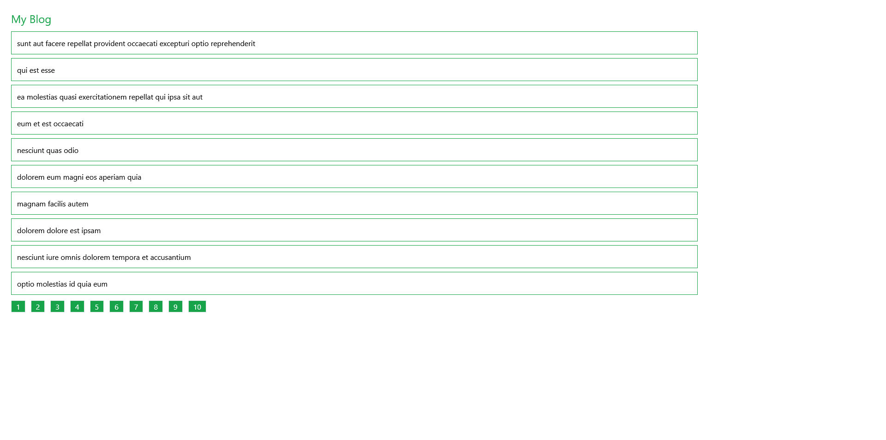

# Products Filtering

This is a practice repository of the [Frontend Pagination](https://youtu.be/IYCa1F-OWmk?si=mz0wQYk77ZqdLHBB) project from [Traversy Media](https://www.youtube.com/@TraversyMedia).

## Table of contents

-   [Overview](#overview)
    -   [The challenge](#the-challenge)
    -   [Screenshot](#screenshot)
    -   [Links](#links)
-   [My process](#my-process)
    -   [Built with](#built-with)
    -   [What I learned](#what-i-learned)
    -   [Continued development](#continued-development)
    -   [Useful resources](#useful-resources)
-   [Author](#author)

## Overview

### The challenge

-   Understanding how to fetch data
-   Understand how to code pagination logic

### Screenshot



### Links

-   Solution URL: [GitHub]()
-   Live Site URL: [Vercel]()

## My process

### Built with

-   Flexbox
-   [React](https://reactjs.org/) - JS library
-   [Tailwind CSS](https://tailwindcss.com/) - CSS framework

### What I learned

In this project, I learnt how to do pagination logic.

```jsx
const [posts, setPosts] = useState([]);
const [loading, setLoading] = useState(false);
const [currentPage, setCurrentPage] = useState(1);
const [postsPerPage] = useState(10);

useEffect(() => {
    const fetchPosts = async () => {
        setLoading(true);
        const res = await axios.get("https://jsonplaceholder.typicode.com/posts");
        setPosts(res.data);
        setLoading(false);
    };

    fetchPosts();
}, []);

// Get current posts
const indexOfLastPost = currentPage * postsPerPage;
const indexOfFirstPost = indexOfLastPost - postsPerPage;
const currentPosts = posts.slice(indexOfFirstPost, indexOfLastPost);

const paginate = (pageNumber) => setCurrentPage(pageNumber);
```

### Continued development

In future projects I will continue to learn and code more various logic with React.

### Useful resources

-   [Simple Frontend Pagination | React](https://youtu.be/IYCa1F-OWmk?si=Hsji3883UummCMpS) - This helped me to implement the project and understand the concepts.
-   [Animation](https://tailwindcss.com/docs/animation) - This docs page helped me how to add spinner to my code.

## Author

-   Instagram - [@mikail.afsin](https://www.instagram.com/mikail.afsin)
